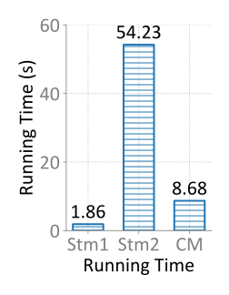

# matplot-templates

Styled plot scripts with `matplotlib`.

Tips may save your time:
1. For each figure in the paper, create a script for plotting
   - name the file `<sec#>-<figname>.py`, e.g. `6-eval-compare-baseline.py`
2. Organize each script in three parts: style, data, plot

**Table of Examples**
| Figure Type     | Script                                                                | Demo                                                                                        |
| --------------- | --------------------------------------------------------------------- | ------------------------------------------------------------------------------------------- |
| Bar             | [5-bar-running-time.py](./examples/5-bar-running-time.py)             |                                                     |
| Multi-bars      | [5-multibars-running-time.py](./examples/5-multibars-running-time.py) |                                           |
| CDF             | [1-config-change-cdf.py](./examples/1-config-change-cdf.py)           |                         |
| horizontal bar  | [6-eval-survey.py](./examples/6-eval-survey.py)                       |                                     |
| Bar and line    | [6-overhead.py](./examples/6-overhead.py)                             |                                           |
| Autocorrelation | [6-relative-risk.py](./examples/6-relative-risk.py)                   |  |
| Stacked bars    | [6-fig13-computing-time.py](./examples/6-fig13-computing-time.py)     |                   |
| Histogram       | [6-multichange.py](./examples/6-multichange.py)                       |                         |
