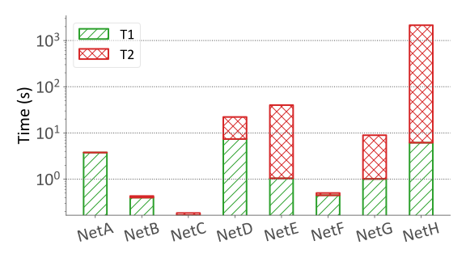

# matplot-templates

Styled plot scripts with `matplotlib`.

Tips may save your time:
1. For each figure in the paper, create a script for plotting
   - name the file `<sec#>-<figname>.py`, e.g. `6-eval-compare-baseline.py`
2. Organize each script in three parts: style, data, plot

**Table of Examples**
| Figure Type     | Demo                                                                                                                                            |
| --------------- | ----------------------------------------------------------------------------------------------------------------------------------------------- |
| CDF             |  [1-config-change-cdf.py](./examples/1-config-change-cdf.py)                |
| horizontal bar  |  [6-eval-survey.py](./examples/6-eval-survey.py)                                        |
| Bar and line    |  [6-overhead.py](./examples/6-overhead.py)                                                    |
| Autocorrelation |  [6-relative-risk.py](./examples/6-relative-risk.py) |
| Stacked bars    |  [6-fig13-computing-time.py](./examples/6-fig13-computing-time.py)    |
| Histogram       |  [6-multichange.py](./examples/6-multichange.py)                            |
